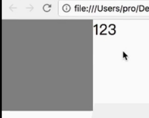

## 盒模型

## 层模型

## 浮动模型
float : left/right
浮动元素产生了浮动流
- 所有产生了浮动流的元素，块级元素找不到它们

- 产生了 **bfc的元素**，和 **文本类属性（in-line）的元素**，以及 **文本**都能看到浮动元素

   文本类属性（in-line）的元素-1:

   
   
   文本类属性（in-line）的元素-2:

   

### 浮动应用场景
- 文字环绕图片
- 导航栏

### 清除浮动
- 利用伪元素
```javascript
.wrapper::after{
    content:"";
    clear:both;
    display:block;
}
```
优点：避免再创建一个元素而造成多出的无用结构
注意点：clear清除浮动效果，必须是块级元素才生效。所以设置display:block。

- 将父元素也浮动

```javascript
.wrapper::after{
    float:left;
}
```
> position:absolutes; float:left/right; 系统会把元素转换成inline-block；