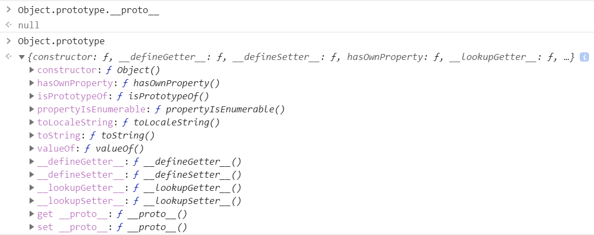
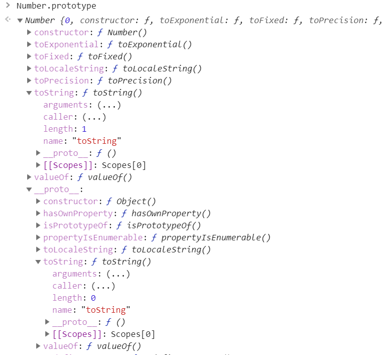

## 原型的定义
```
原型是function 对象的一个属性，它定义了构造函数制造出的对象的公共祖先。
通过该构造函数产生的对象，可以继承该原型的属性箅方法。原型也是对象。
```

## 定义原型（的属性）
### 原型在函数刚出生的时候，其实就已经定义（创建）好了
```javascript
// Person.prototype -- 原型，在函数Person 刚出生的时候，就定义好了
// Person.prototype = {} -- 可以理解为是一个空对象（其实并不空），
// 是这个构造函数构造出的对象的“祖先”。
function Person() {
    // 构造函数会在创建this的时候：
    // var this = {
    //     __proto__:Person.prototype
    // }

    // 可以用自己的属性覆盖原型的属性
    // 覆盖方式1：构造函数内通过this覆盖
    this.firstName = 'Chao';
}
``` 

但是我们如果需要自定义原型及属性也是可以的。
### 定义方式一
一个一个属性的，去添加定义
```javascript
Person.prototype.lastName = 'Deng';
Person.prototype.firstName = 'Daye';
Person.prototype.fav = 'movie'
Person.prototype.say = function () {
    console.log('hehe');
}
```

### 定义方式二
直接定义一个对象，然后赋值给Person.prototype，更简洁。
```javascript
Person.prototype = {
    lastName : 'Deng';
    firstName : 'Daye';
    fav : 'movie'
    say : function () {
        console.log('hehe');
    }
}
```

### 用后代对象的属性覆盖原型的属性
```javascript
function Person() {
    // 可以用自己的属性覆盖原型的属性
    // 覆盖方式1：构造函数内通过this覆盖
    this.firstName = 'Chao';
}

var person1 = new Person();
var person2 = new Person();
console.log(person1.lastName);   // Deng
console.log(person2.lastName);   // Deng

// 打印被方式1覆盖的结果
console.log(person1.firstName);   // Chao
console.log(person2.firstName);   // Chao

// 覆盖方式2：在构造函数外通过对象覆盖
person1.lastName = 'Ji';    // J.这里赋值的属性其实:
                            // 相当于this.lastName = 'Ji';
                            // 而非Person.prototype.lastName = 'Ji';
console.log(person1.lastName);   // Ji
console.log(person2.lastName);   // Deng
```
从上面可以看到通过构造函数创建出的（后代）对象，是不能修改原型的属性的，那样修改的其实只是（后代）对象本身（与原型对象同名属性）的属性而已。


### 原型属性的增、删、改、查
#### 增、查
在上面的代码中已经有了

#### 改：
```javascript
console.log(person1.fav);   // movie
console.log(person2.fav);   // movie
// 改：
Person.prototype.fav = 'music';
console.log(person1.fav);   // music
console.log(person2.fav);   // music
```
#### 删：
```javascript
delete Person.prototype.fav;
console.log(person1.fav);   // undefined
console.log(person2.fav);   // undefined
```
<!-- ## 对原型修改操作的进一步理解 -->
### 原型对象的查看与修改
```javascript
Car.prototype.carName = 'BMW';
Car.prototype.height = 1400;
Car.prototype.lang = 4900;
function Car(color, owner) {
    this.owner = owner;
    this.color = color;
}

var car = new Car('red','prof.ji');
var car = new Car('red','prof.ji');
```

- 隐式属性：图中浅色的属性，是系统隐式自动创建的属性。
- 自定义属性：图中深色的属性，是我们自己定义的属性。
#### 对象如何查看原型
->隐式属性：\_\_proto__
```javascript
console.log(car.__proto__);   
// {carName: "BMW", height: 1400, lang: 4900, constructor: ƒ}
```

#### 对象的原型对象可以被修改
默认情况下对象的原型 **_\_proto__** 是由系统指定的：
```javascript
// Person.prototype = {}。
function Person() {
    // 构造函数会在创建this的时候：
    // var this = {
    //     __proto__:Person.prototype
    // }
}

var person = new Person();
```

但是，也可以人为的修改：
```javascript
var obj = {
    name : 'sunny'
}
person.__proto__ = obj;
console.log(person.name);   // sunny
```
### 原型属性操作的进一步理解
可以看到，对原型属性进行查询操作，可以直接通过（后代）对象来访问，而如果想对原型的属性进行增、删、改这些 **修改操作**，还是要通过原型对象本身来。不过呢，这话既对，又不全对，因为这是指的是原始值。可如果原型对象的某个属性是引用值类型，那么通过后代对象修改这个（引用类型）属性的属性，也算是（间接）修改了原型对象（的属性的属性）。这种修改是“引用值自己的修改”。
参照：[原型_原始值属性和引用值属性.html](原型_原始值属性和引用值属性.html)
```javascript
function Father() {
    this.fortune = {
        card1: 'visa'
    }
}
var father = new Father()

Son.prototype = father;
function Son() {
}
var son = new Son();

// 后代对象与原型对象的属性是一致的
console.log(father.fortune.card1);  // visa
console.log(son.fortune.card1); // visa
```

1. 如果通过后代对象，是无法“直接”修改“属性本身”
```javascript
son.fortune = 'son.fortune';
console.log(son.fortune);   //  son.fortune
console.log(son.fortune.card1); // undefined
console.log(father.fortune.card1);  // visa
```

2. 但可以修改原型对象中“**引用值类型属性的属性**”，也就是 **属性的属性**。
```javascript
son.fortune.card1 = 'master';
console.log(son.fortune);   //  {card1: "master"}
console.log(son.fortune.card1); // master
console.log(father.fortune.card1);  // master
```

3. 还可以间接的给原型对象中“**引用值类型属性**”添加新属性
```javascript
son.fortune.card2 = 'UnionPay';
console.log(son.fortune.card2); // UnionPay
console.log(father.fortune.card2);  // UnionPay
```
#### 看几个案例：
1. 

```javascript
function Father() {
    this.num = 100;
}
var father = new Father()

Son.prototype = father;
function Son() {
}
var son = new Son();

// 这句代码的实际执行效果是：son.num = son._\_ptoto__.num + 1
son.num ++;

console.log(father.num);    // 100
console.log(son.num)    // 101
```
son.num++ 实际上是先把father.num 的值取出来，但是把++ 运算的结果保存到了son自己的num 属性里，也就是实际的执行过程是：
son.num = son._\_ptoto__.num + 1

2.
```javascript
Person.prototype = {
    name:'a',
    // 谁调用这个方法 this，就指向谁
    sayName:function(){
        console.log(this.name);
    }
}

var person = new Person();

// 1.
// function Person(name, age,sex) {
// }
// person.sayName();   // a

// 2.
function Person(name, age,sex) {
    this.name = 'b';
}
person.sayName();   // b
```

3.
```javascript
Person.prototype = {
    height :100
}
function Person(name, age, sex) {
    this.eat = function () {
        this.height++;
        return this.height;
    }
}
var person = new Person();

person.eat()
console.log(person.height);  // 101
console.log(person.__proto__.height);  // 100

person.eat()
console.log(person.height);  // 102
console.log(person.__proto__.height);  // 100

person.eat()
console.log(person.height);  // 103
console.log(person.__proto__.height);  // 100
```

## 原型链
### 如何构成原型链
- 原型链的连接点就是 \_\_proto__
- 沿原型链依次查找属性
当访问某个对象的属性时，会先查找对象本身的属性，如果没有找到，就会到原型对象中去找，如果还没有找到，就到原型的原型中去依次去找，直到找到属性，或者找到原型链的最顶端。
<br/>
   > 和作用域链类似，都是就近原则取值。


### 原型链的增、删、改、查
原型链上的属性的增、删、改、查和原型属性的是一致的。

## 另一种原型创建方式：Object.create(原型,设定)
> 这个方法有两个参数，这里只用第一个参数，第二个参数，是对属性的设定，另外讲。
1.
```javascript
var obj = {name:'sunny', age:123};
var obj1 = Object.create(obj);

console.log(obj1.name);  // sunny
```
相当于：

```javascript
var obj = {name:'sunny', age:123};
var obj1 = {
    __proto__:obj
}

console.log(obj1.name);  // sunny
```
2.
```javascript
function test() {
    // 构造函数会被系统隐式添加：
    // var this = Object.create(test.prototype);
    // 也相当于
    // var this = {
    //     __proto__:test.prototype
    // }

}
new test();
```

### 绝大多数对象的最终都会继承自Object.prototype
如下：
```javascript
var obj = {};
```


但是也（可以）有例外的情况，看下图打印的信息：

_03.png)

上面报错信息中说的很清楚：原型对象只能是Object，或者null。

那么对象的原型设置为一个对象，和设置为null，有什么不同呢？
### 比较：原型设置为对象 vs 原型设置为null

#### 1. 原型设置为对象
##### eg1.
```javascript
var obj1 = {
    name: 'sunny'
}
var obj2 = {
    name: 'susam'
}
// 1. 正常的把一个对象obj1 赋值给obj 当原型。
var obj = Object.create(obj1);
// 可以正常访问原型中的属性
console.log(obj.name);   // sunny

// 2. 通过__proto__ 把obj2 设置为obj 的原型。
obj.__proto__ = obj2;
// 仍然可以正常访问原型中的属性
console.log(obj.name);  // susam
``` 
- 在这段代码中，正常的把一个对象obj1 赋值给obj 当原型。obj 可以正常的访问到原型对象中的属性“name”。
- 而且在通过__proto__ 把obj2 设置为obj 的原型后，仍然可以正常访问到新有原型属性。

vs
#### 2. 原型设置为null
##### eg2.1
```javascript
var obj1 = {
    name: 'sunny'
}
// 1. 通过Object.create(null) 创建一个原型设置为null 的对象obj。
var obj = Object.create(null);
// 没有name属性
console.log(obj.name);   // undefined

// 2. 通过__proto__ 把obj1 设置为obj 的原型。
obj.__proto__ = obj1;
// 访问不到原型中的属性
console.log(obj.name);  // undefined
``` 
-  而在这段代码中，先把obj 原型设置为null。obj 没有name属性，肯定访问不到。
- 而且在通过__proto__ 把obj1 设置为obj 的原型后，仍然访问不到原型中的属性。

##### eg2.2
```javascript
var obj1 = {
    name: 'sunny'
}
var obj = {};

// 1. 通过直接赋值的方式把obj 原型设置为null。
obj.__proto__= null;
// 没有name属性
console.log(obj.name);   // undefined

// 2. 通过__proto__ 把obj1 设置为obj 的原型。
obj.__proto__ = obj1;
// 访问不到原型中的属性
console.log(obj.name);  // undefined
``` 
效果与2.2一样。

> 可以看到，如果设置对象的原型为null，那么对象将不能再继承原型的属性，哪怕后来再设置它的原型为其他对象。

### 原型链的最顶端：Object.prototype._\_proto__


> 猜想1：从打印信息中看，虽然Object.prototype 中没有看到有_\_proto__ 这个属性，但是当想访问它的时候，它打印出的信息是null。所以Object.prototype._\_proto__可能是被定义在闭包里。只有这样，才会在对象（原型链）中看不到，但是却又能（在作用域中）访问到。

> 猜想2：结合上面的比较案例来看，是不是当把一个对象的原型设置为null后，系统就会把这个对象当成一个没有原型的对象，或者说 **_\_proto__ = null** 就是一个对象作为原型链最顶端的标志。

### toString 方法
- 对象的toString 方法继承自Object.prototype。如果一个对象的原型链中不存在Object.prototype 那么，又没有自定义toString 方法，那么就调用不了toString方法。

- Number、Array 等一些构造函数的prototype 属性中重写了toString 方法。所以它们构造出来的对象，调用toString 方法时，会打印出各自不同的信息。
例如，Number.prototype.toString 方法：

   

- null 和undefined 不能toString 方法。

## 原型的应用
利用原型特点和概念，可以提取共有（？感觉这里应该叫“通用”更好）属性。

例如：生产中有一些相同的、没有差异的零部件（属性值），提取出来，放到原型里面。
```javascript
function Car(color, owner) {
    this.owner = owner;
    this.carName = 'BMW';
    this.height = 1400;
    this.lang = 4900;
    this.color = color;
}

var car = new Car('red','prof.ji');
var car = new Car('red','prof.ji');
```
上面代码中，只有color，和owner 这两个属性需要个性化，其他的属性都一样。

所以，可以改造成：
```javascript
Car.prototype.carName = 'BMW';
Car.prototype.height = 1400;
Car.prototype.lang = 4900;
function Car(color, owner) {
    this.owner = owner;
    this.color = color;
}

var car = new Car('red','prof.ji');
var car = new Car('red','prof.ji');
```

